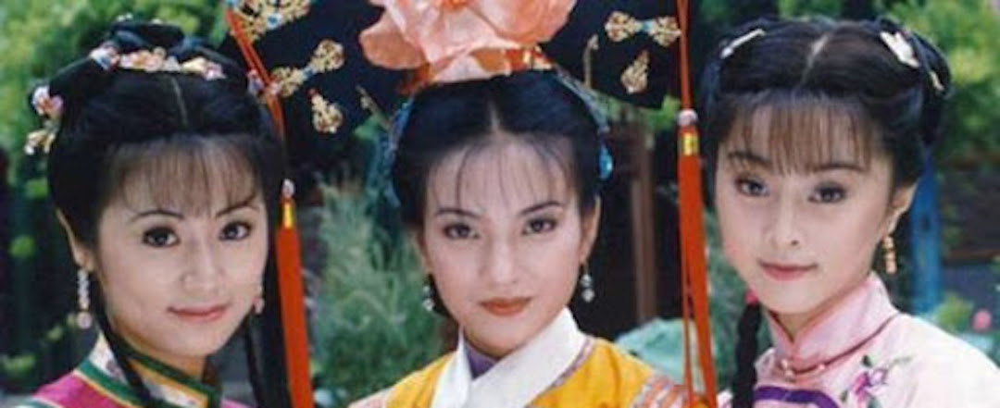
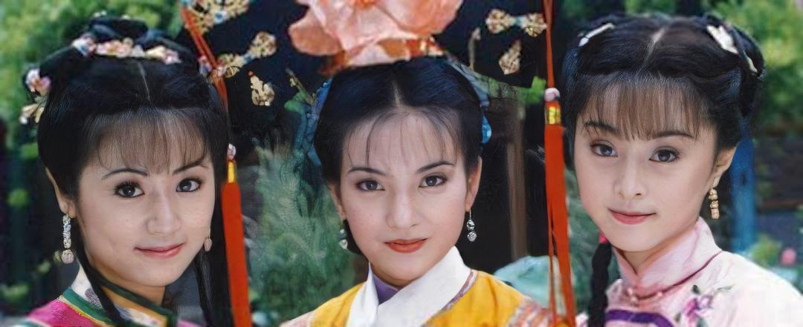

# PSFR-GAN in PyTorch 

[Progressive Semantic-Aware Style Transformation for Blind Face Restoration](https://arxiv.org/abs/2009.08709)  
[Chaofeng Chen](https://chaofengc.github.io), [Xiaoming Li](https://csxmli2016.github.io/), [Lingbo Yang](https://lotayou.github.io), [Xianhui Lin](https://dblp.org/pid/147/7708.html), [Lei Zhang](https://www4.comp.polyu.edu.hk/~cslzhang/), [Kwan-Yee K. Wong](https://i.cs.hku.hk/~kykwong/)




### Changelog 
- **2021.04.26**: Add pytorch vgg19 model to GoogleDrive and remove `--distributed` option which causes training error.
- **2021.03.22**: Update new model at 15 epoch (52.5k iterations).
- **2021.03.19**: Add train codes for PSFRGAN and FPN.

## Prerequisites and Installation
- Ubuntu 18.04
- CUDA 10.1  
- Clone this repository
    ```
    git clone https://github.com/chaofengc/PSFR-GAN.git
    cd PSFR-GAN
    ```
- Python 3.7, install required packages by `pip3 install -r requirements.txt`  

## Quick Test

### Download Pretrain Models and Dataset
Download the pretrained models from the following link and put them to `./pretrain_models`  
- [GoogleDrive](https://drive.google.com/drive/folders/1Ubejhxd2xd4fxGc_M_LWl3Ux6CgQd9rP?usp=sharing)
- [BaiduNetDisk](https://pan.baidu.com/s/1cru3uUASEfGX6p6L0_7gWQ), extract code: `gj2r`

### Test single image
Run the following script to enhance face(s) in single input  
```
python test_enhance_single_unalign.py --test_img_path ./test_dir/test_hzgg.jpg --results_dir test_hzgg_results --gpus 1
```

This script do the following things:
- Crop and align all the faces from input image, stored at `results_dir/LQ_faces`  
- Parse these faces and then enhance them, results stored at `results_dir/ParseMaps` and `results_dir/HQ`  
- Paste then enhanced faces back to the original image `results_dir/hq_final.jpg`  
- You can use `--gpus` to specify how many GPUs to use, `<=0` means running on CPU. The program will use GPU with the most available memory. Set `CUDA_VISIBLE_DEVICE` to specify the GPU if you do not want automatic GPU selection.  

### Test image folder 
To test multiple images, we first crop out all the faces and align them use the following script.  
```
python align_and_crop_dir.py --src_dir test_dir --results_dir test_dir_align_results
```  

For images (*e.g.* `multiface_test.jpg`) contain multiple faces, the aligned faces will be stored as `multiface_test_{face_index}.jpg`  
And then parse the aligned faces and enhance them with  
```
python test_enhance_dir_align.py --src_dir test_dir_align_results --results_dir test_dir_enhance_results
```  
Results will be saved to three folders respectively: `results_dir/lq`, `results_dir/parse`, `results_dir/hq`.   

### Additional test script

For your convenience, we also provide script to test multiple unaligned images and paste the enhance results back. **Note the paste back operation could be quite slow for large size images containing many faces (dlib takes time to detect faces in large image).**
```
python test_enhance_dir_unalign.py --src_dir test_dir --results_dir test_unalign_results
```  
This script basically do the same thing as `test_enhance_single_unalign.py` for each image in `src_dir`

## Train the Model

### Data Preparation

- Download [FFHQ](https://github.com/NVlabs/ffhq-dataset) and put the images to `../datasets/FFHQ/imgs1024`
- Download parsing masks (`512x512`) [HERE](https://drive.google.com/file/d/1eQwO8hKcaluyCnxuZAp0eJVOdgMi30uA/view?usp=sharing) generated by the pretrained FPN and put them to `../datasets/FFHQ/masks512`.

*Note: you may change `../datasets/FFHQ` to your own path. But images and masks must be stored under `your_own_path/imgs1024` and `your_own_path/masks512` respectively.*

### Train Script for PSFRGAN

Here is an example train script for PSFRGAN:

```
python train.py --gpus 2 --model enhance --name PSFRGAN_v001 \
    --g_lr 0.0001 --d_lr 0.0004 --beta1 0.5 \
    --gan_mode 'hinge' --lambda_pix 10 --lambda_fm 10 --lambda_ss 1000 \
    --Dinput_nc 22 --D_num 3 --n_layers_D 4 \
    --batch_size 2 --dataset ffhq  --dataroot ../datasets/FFHQ \
    --visual_freq 100 --print_freq 10 #--continue_train
```
- Please change the `--name` option for different experiments. Tensorboard records with the same name will be moved to `check_points/log_archive`, and the weight directory will only store weight history of latest experiment with the same name.
- `--gpus` specify number of GPUs used to train. The script will use GPUs with more available memory first. To specify the GPU index, use `export CUDA_VISIBLE_DEVICES=your_gpu_ids` before the script.
- Uncomment `--continue_train` to resume training. *Current codes do not resume the optimizer state.* 
- It needs at least **8GB** memory to train with **batch_size=1**. 

### Scripts for FPN

You may also train your own FPN and generate masks for the HQ images by yourself with the following steps: 

- Download [CelebAHQ-Mask](https://github.com/switchablenorms/CelebAMask-HQ) dataset. Generate `CelebAMask-HQ-mask` and `CelebAMask-HQ-mask-color` with the provided scripts in `CelebAMask-HQ/face_parsing/Data_preprocessing/`.
- Train FPN with the following commmand
```
python train.py --gpus 1 --model parse --name FPN_v001 \
    --lr 0.0002 --batch_size 8 \
    --dataset celebahqmask --dataroot ../datasets/CelebAMask-HQ \
    --visual_freq 100 --print_freq 10 #--continue_train
```
- Generate parsing masks with your own FPN using the following command:
```
python generate_masks.py --save_masks_dir ../datasets/FFHQ/masks512 --batch_size 8 --parse_net_weight path/to/your/own/FPN 
```

## Citation
```
@inproceedings{ChenPSFRGAN,
    author = {Chen, Chaofeng and Li, Xiaoming and Lingbo, Yang and Lin, Xianhui and Zhang, Lei and Wong, KKY},
    title = {Progressive Semantic-Aware Style Transformation for Blind Face Restoration},
    Journal = {IEEE Conference on Computer Vision and Pattern Recognition (CVPR)},
    year = {2021}
}
```

## License

<a rel="license" href="http://creativecommons.org/licenses/by-nc-sa/4.0/"></a><br />This work is licensed under a <a rel="license" href="http://creativecommons.org/licenses/by-nc-sa/4.0/">Creative Commons Attribution-NonCommercial-ShareAlike 4.0 International License</a>.

## Acknowledgement

This work is inspired by [SPADE](https://github.com/NVlabs/SPADE), and closed related to [DFDNet](https://github.com/csxmli2016/DFDNet) and [HiFaceGAN](https://github.com/Lotayou/Face-Renovation). Our codes largely benefit from [CycleGAN](https://github.com/junyanz/pytorch-CycleGAN-and-pix2pix).
